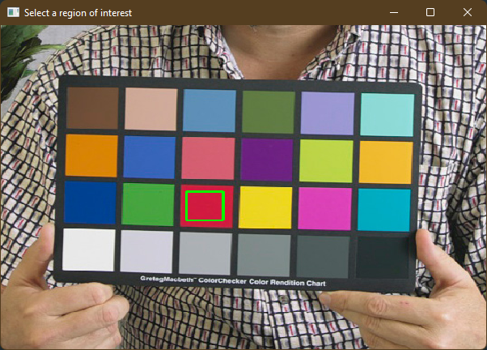
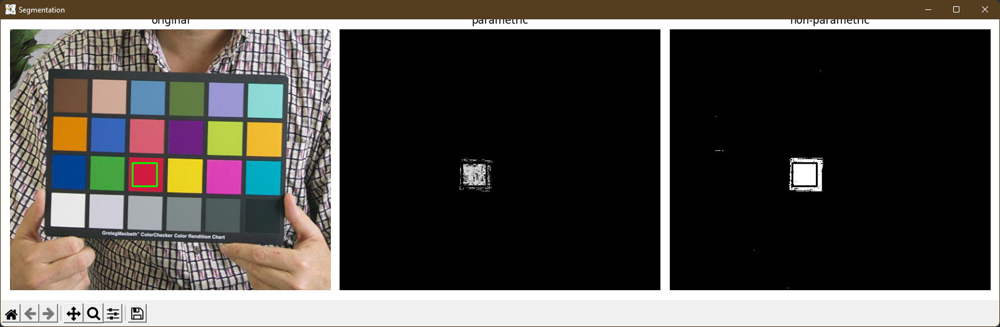

# Image Segmentation

## Background
This script uses two algorithms to perform image segmentation: 
parametric segmentation via probability distribution estimation, and
non-parametric segmentation via histogram backprojection.

Further reading: [Activity 7: Image Segmentation](https://kvdomingo.xyz/svip/ap186/image-segmentation).

## Requirements
- Python 3.10 or later

## Setup
1. Clone the repo & install requirements
```shell
pip install -r requirements.txt
```
2. Run script
```shell
python main.py <path_to_file>
```

## Using
1. Select region of interest by dragging a rectangle over the image



2. Press <kbd>c</kbd> on your keyboard to preview the ROI.


3. Press <kbd>c</kbd> again to perform parametric & non-parametric segmentation.


